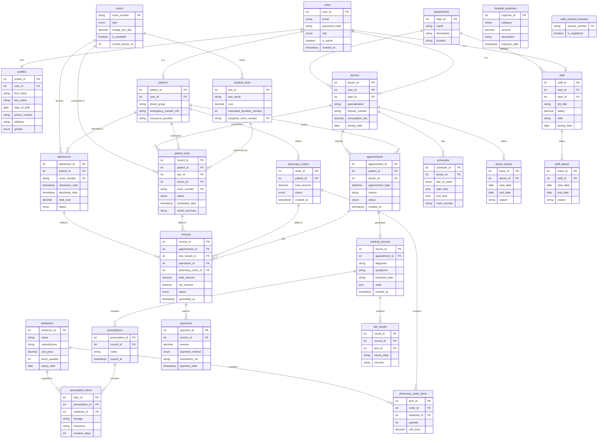

```mermaid
erDiagram
    users {
        int user_id PK
        string email
        string password_hash
        enum role
        boolean is_active
        timestamp created_at
    }

    profiles {
        int profile_id PK
        int user_id FK
        string first_name
        string last_name
        date date_of_birth
        string phone_number
        string address
        enum gender
    }

    departments {
        int dept_id PK
        string name
        string description
        string location
    }

    doctors {
        int doctor_id PK
        int user_id FK
        int dept_id FK
        string specialization
        string license_number
        decimal consultation_fee
        date joining_date
    }

    patients {
        int patient_id PK
        int user_id FK
        string blood_group
        string emergency_contact_info
        string insurance_provider
    }

    staff {
        int staff_id PK
        int user_id FK
        int dept_id FK
        string job_title
        decimal salary
        string shift
        date joining_date
    }

    appointments {
        int appointment_id PK
        int patient_id FK
        int doctor_id FK
        datetime appointment_date
        string reason
        enum status
        timestamp created_at
    }

    medical_records {
        int record_id PK
        int appointment_id FK
        string diagnosis
        string symptoms
        string treatment_plan
        json vitals
        timestamp created_at
    }

    prescriptions {
        int prescription_id PK
        int record_id FK
        string notes
        timestamp issued_at
    }

    medicines {
        int medicine_id PK
        string name
        string manufacturer
        decimal unit_price
        int stock_quantity
        date expiry_date
    }

    prescription_items {
        int item_id PK
        int prescription_id FK
        int medicine_id FK
        string dosage
        string frequency
        int duration_days
    }

    invoices {
        int invoice_id PK
        int appointment_id FK
        int test_record_id FK
        int admission_id FK
        int pharmacy_order_id FK
        decimal total_amount
        decimal net_amount
        enum status
        timestamp generated_at
    }

    payments {
        int payment_id PK
        int invoice_id FK
        decimal amount
        enum payment_method
        string transaction_ref
        timestamp payment_date
    }

    rooms {
        string room_number PK
        enum type
        decimal charge_per_day
        boolean is_available
        int current_doctor_id
    }

    admissions {
        int admission_id PK
        int patient_id FK
        string room_number FK
        timestamp admission_date
        timestamp discharge_date
        decimal total_cost
        enum status
    }

    medical_tests {
        int test_id PK
        string test_name
        decimal cost
        int estimated_duration_minutes
        string assigned_room_number FK
    }

    patient_tests {
        int record_id PK
        int patient_id FK
        int test_id FK
        int doctor_id FK
        string room_number FK
        enum status
        timestamp scheduled_date
        string result_summary
    }

    lab_results {
        int result_id PK
        int record_id FK
        int test_id FK
        string result_value
        string remarks
    }

    pharmacy_orders {
        int order_id PK
        int patient_id FK
        decimal total_amount
        enum status
        timestamp created_at
    }

    pharmacy_order_items {
        int item_id PK
        int order_id FK
        int medicine_id FK
        int quantity
        decimal unit_price
    }

    schedules {
        int schedule_id PK
        int doctor_id FK
        enum day_of_week
        time start_time
        time end_time
        string room_number
    }

    doctor_leaves {
        int leave_id PK
        int doctor_id FK
        date start_date
        date end_date
        string reason
    }

    staff_leaves {
        int leave_id PK
        int staff_id FK
        date start_date
        date end_date
        string reason
    }

    hospital_expenses {
        int expense_id PK
        string category
        decimal amount
        string description
        timestamp expense_date
    }

    valid_medical_licenses {
        string license_number PK
        boolean is_registered
    }

    users ||--|| profiles : "has"
    users ||--o| doctors : "is a"
    users ||--o| patients : "is a"
    users ||--o| staff : "is a"
    departments ||--o{ doctors : "employs"
    departments ||--o{ staff : "employs"
    patients ||--o{ appointments : "books"
    doctors ||--o{ appointments : "attends"
    appointments ||--o| medical_records : "generates"
    medical_records ||--o{ prescriptions : "contains"
    prescriptions ||--o{ prescription_items : "includes"
    medicines ||--o{ prescription_items : "supplied in"
    appointments ||--o{ invoices : "bills"
    invoices ||--o{ payments : "paid by"
    patients ||--o{ admissions : "admitted to"
    rooms ||--o{ admissions : "houses"
    medical_tests ||--o{ patient_tests : "performed as"
    patients ||--o{ patient_tests : "undergoes"
    doctors ||--o{ patient_tests : "prescribes"
    rooms ||--o{ medical_tests : "hosts"
    rooms ||--o{ patient_tests : "conducted in"
    patients ||--o{ pharmacy_orders : "orders"
    pharmacy_orders ||--o{ pharmacy_order_items : "contains"
    medicines ||--o{ pharmacy_order_items : "contains"
    doctors ||--o{ schedules : "has"
    doctors ||--o{ doctor_leaves : "takes"
    staff ||--o{ staff_leaves : "takes"
    medical_records ||--o{ lab_results : "contains"
    pharmacy_orders ||--o{ invoices : "billed in"
    patient_tests ||--o{ invoices : "billed in"
    admissions ||--o{ invoices : "billed in"
```
